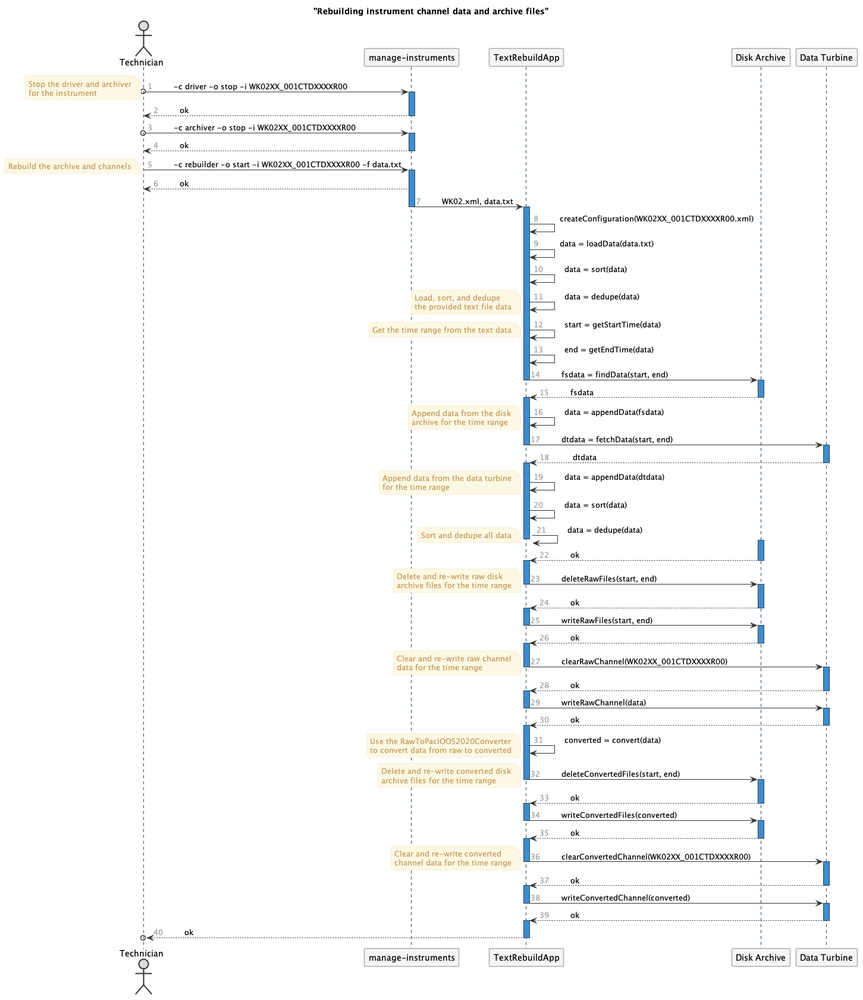

Rebuilding instrument channel and archive data
==============================================

We periodically need to recreate channel data and archive files due to gaps in the data caused by network communication drops, stopped drivers, server maintenance, etc.  This is enabled using the ``manage-instruments`` script with a ``rebuilder`` command.  This document outlines the workflow based on that command.

Rebuild Sequence Diagram
------------------------

..
    @startuml images/rebuild-workflow.png

    !include ../plantuml-styles.txt
    autonumber ""
    title "Rebuilding instrument channel data and archive files"
    actor Technician as tech
    participant "manage-instruments" as script
    participant TextRebuildApp as app
    participant "Disk Archive" as fs
    participant "Data Turbine" as dt

    tech o-> script: \t-c driver -o stop -i WK02
    note left
        Stop the driver and archiver
        for the instrument
    end note
    activate script
        script --> tech: \tok
    deactivate script

    tech o-> script: \t-c driver -o stop -i WK02
    activate script
        script --> tech: \tok
    deactivate script

    tech -> script: \t-c rebuilder -o start -i WK02 -f data.txt
    note left
        Rebuild the archive and channels
    end note
    activate script
        script --> tech: \tok
        script -> app: \tWK02.xml, file.txt
    deactivate script

    activate app
        app -> app: \tcreateConfiguration(WK02.xml)
        app -> app: \tdata = loadData(data.txt)
        app -> app: \tdata = sort(data)
        app -> app: \tdata = dedupe(data)

        note left
            Load, sort, and dedupe
            the provided text file data
        end note

        app -> app: \tstart = getStartTime(data)
        note left
            Get the time range from the text data
        end note
        app -> app: \tend = getEndTime(data)
        app -> fs: \tfsdata = findData(start, end)
    deactivate app

    activate fs
        fs --> app: \tfsdata
    deactivate fs

    activate app
        app -> app: \tdata = appendData(fsdata)

        note left
            Append data from the disk
            archive for the time range
        end note

        app -> dt: \tdtdata = fetchData(start, end)
    deactivate app

    activate dt
        dt --> app: \t dtdata
    deactivate dt

    activate app
        app -> app: \tdata = appendData(dtdata)

        note left
            Append data from the data turbine
            for the time range
        end note

        app -> app: \tdata = sort(data)
        app -> app: \tdata = dedupe(data)

        note left
            Sort and dedupe all data
        end note
    deactivate app

    activate fs
        fs --> app: \tok
    deactivate fs

    activate app
        app -> fs: \tdeleteRawFiles(start, end)

        note left
            Delete and re-write raw disk
            archive files for the time range
        end note
    deactivate app

    activate fs
        fs --> app: \tok
    deactivate fs

    activate app
        app -> fs: \twriteRawFiles(start, end)
    deactivate app

    activate fs
        fs --> app: \tok
    deactivate fs

    activate app
        app -> dt: \tclearRawChannel(WK02)

        note left
            Clear and re-write raw channel
            data for the time range
        end note
    deactivate app

    activate dt
        dt --> app: \tok
    deactivate dt

    activate app
        app -> dt: \twriteRawChannel(data)
    deactivate app

    activate dt
        dt --> app: \tok
    deactivate dt

    activate app
        app -> app: \tconverted = convert(data)
        note left
            Use the RawToPacIOOS2020Converter
            to convert data from raw to converted
        end note
        app -> fs: \tdeleteConvertedFiles(start, end)

        note left
            Delete and re-write converted disk
            archive files for the time range
        end note
    deactivate app

    activate fs
        fs --> app: \tok
    deactivate fs

    activate app
        app -> fs: \twriteConvertedFiles(converted)
    deactivate app

    activate fs
        fs --> app: \tok
    deactivate fs

    activate app
        app -> dt: \tclearConvertedChannel(WK02)

        note left
            Clear and re-write converted
            channel data for the time range
        end note
    deactivate app

    activate dt
        dt --> app: \tok
    deactivate dt

    activate app
        app -> dt: \twriteConvertedChannel(converted)
    deactivate app

    activate dt
        dt --> app: \tok
    deactivate dt

    activate app
        app -->o tech: \tok
    deactivate app
    @enduml

The technician downloads data from an instrument flash card and saves it as a text file on ``realtime.pacioos.hawaii.edu``.  They then use the ``manage-instruments`` script to stop the instrument driver and archiver so there's no activity for the Data Turbine channel and the disk archive directory for the given instrument (``WK02`` above being a shortened version of the ``WK02XX_001CTDXXXXR00`` instrument identifier for display purposes only.

Once the realtime data and archiving is paused, the technician uses the ``manage-instruments`` script to rebuild the archive by providing the instrument identifier and the text file of the downloaded data.  The script will spin up a ``TextRebuildApp`` that parses the instrument configuration file, loads the raw text data, sorts it based on the data timestamps, and deduplicates any repeat sample lines.  Once complete, it gets the earliest and latest timestamps in the text file to establish the range of dates that need to be rebuilt in the disk archive and in the Data Turbine.

It then finds the files in the disk raw archive directory within that time range, and appends the archived data to the already loaded raw data.  Likewise, it fetches the raw data for the given time range from the Data Turbine and appends it as well.

With all possible sources of raw data, the ``TextRebuildApp`` then sorts and and de-duplicates the data again, creating a rebuilt raw product.  This is then written to the raw disk archive after deleting existing files in the time range.  It then clears the Data Turbine raw channel, and repopulates that channel with the rebuilt data.

After the raw files data are rebuilt, the ``TextRebuildApp`` uses the ``RawToPacIOOS2020Coverter`` to convert the data to the new format.  It then deletes the converted disk archive files for the time range, and re-populates the converted Data Turbine channel for the instrument.