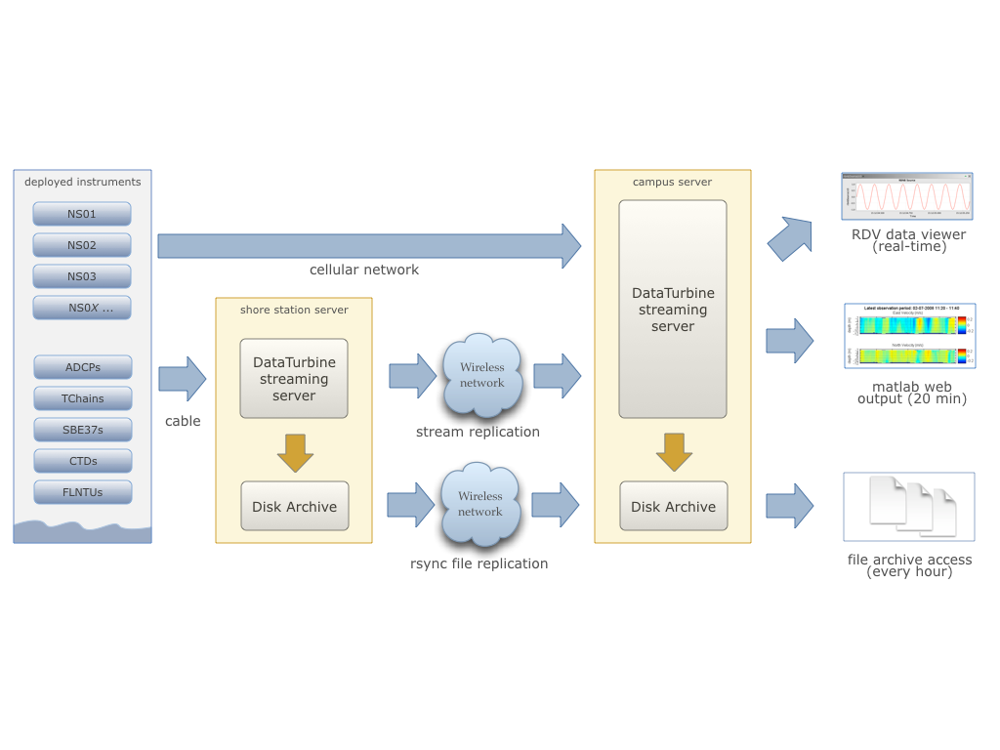
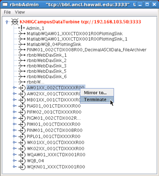
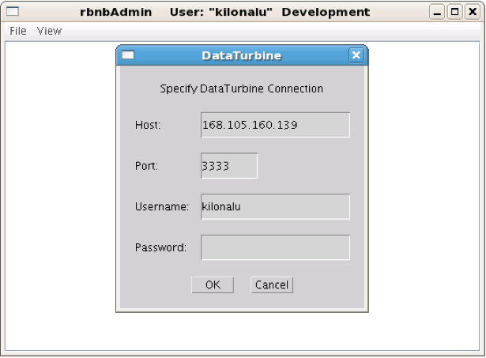
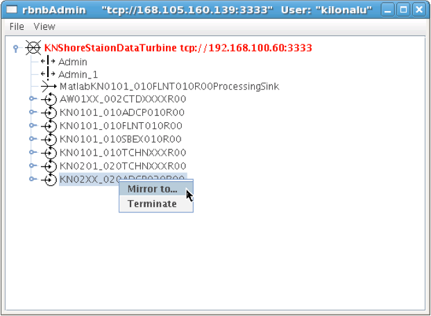
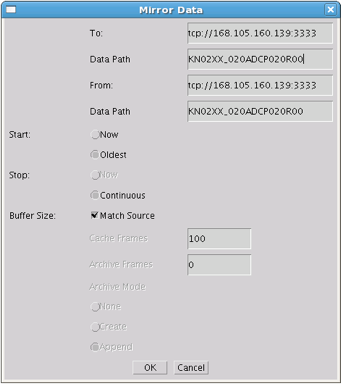
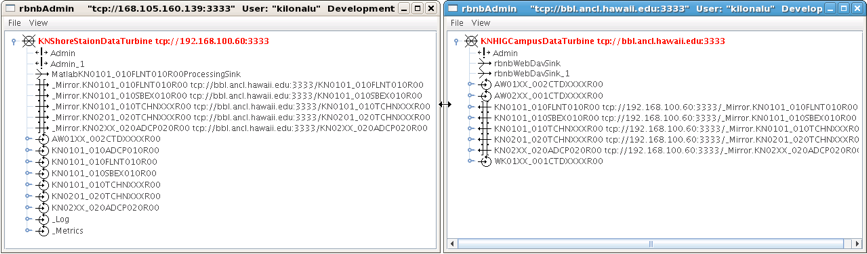
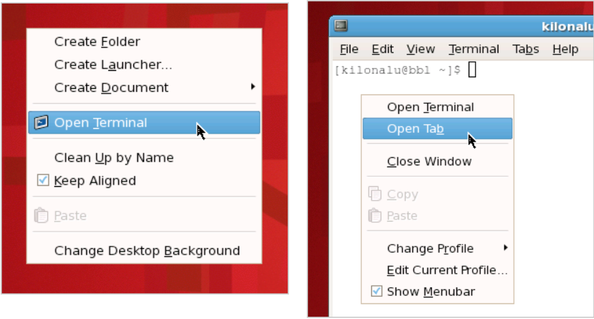
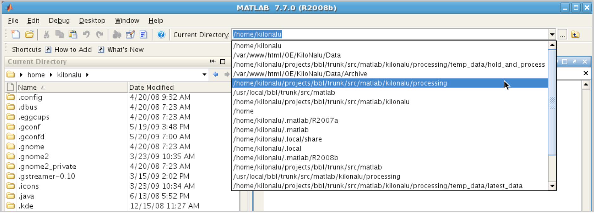

Overview
========

The Kilo Nalu streaming system is a centralized means of collecting data in near real-time that uses the Open Source DataTurbine software (see http://www.dataturbine.org).  The system consists of instruments deployed on the Kilo Nalu cable array (and others via wireless connections) that communicate with the DataTurbine streaming service via customized drivers (written in Java) that understand the stream formats of each instrument.  These drivers are known as ‘Sources’, and the names of the drivers reflect this (e.g. ADCPSource).  Software client programs that connect to the DataTurbine to fetch data are known as ‘Sinks’, and their names reflect this as well (e.g. FileArchiverSink).  The primary DataTurbine installation is on the shore station linux server, and mirrors the data streams to the secondary DataTurbine installation at the UH Manoa campus via the wireless VPN connection.  At the shore station, data streams are fetched from the DataTurbine on an hourly or daily basis (depending on the specific instrument), and are archived to disk by the FileArchiverSink client for each instrument.   These files are also mirrored to the campus Linux server via an hourly process (using the `rsync` command).   Web-based graphics are produced using Matlab code that queries the campus DataTurbine on a scheduled basis.
Each of these system components are described in more detail below, along with instructions on how to manage each of them.  **Note: This guide assumes familiarity with the Linux operating system and commands.**

   
*Figure 1. Overview of the Kilo Nalu real-time data software and backup architecture.  Data are mirrored to the campus system using the DataTurbine software and via rsync, and are accessed by desktop and web-based applications. Note: The KiloNalu cable array is currently shut down and offline.*
  
Managing the DataTurbine Server Software
========================================

The DataTurbine software is installed in `/usr/local/RBNB/current`.  It’s running on port `3333` both on the shore station Linux server (Internet IP: `168.105.160.139`, VPN IP `192.168.100.60`) and the UH campus server (Internet IP: `bbl.ancl.hawaii.edu`, VPN IP: `192.168.103.50`), and is set up as a standard Linux service installed in the `/etc/init.d` directory, with a run level script called `rbnb`.   The DataTurbine is set to start whenever each of the systems is rebooted.  The server’s event log is located in `/var/log/rbnb/rbnb.log`.  The DataTurbine’s internal stream archive is located in `/var/lib/rbnb`.  In the event that instrument source drivers cannot connect to the DataTurbine, look at the event log to see if there are connection, memory, or file system errors.  If so, the DataTurbine service may need to be restarted, the stream archives reloaded (automatic), and the instrument drivers reconnected.

Starting the DataTurbine
------------------------

The DataTurbine service is started like any other Linux service by calling the run-level script.  To do so, as the kilonalu user, ssh to the Linux server in question (shore lab or campus lab), and execute the following command in a terminal
::

$ sudo service rbnb start

If prompted, enter the `kilonalu` user’s password.  This will start the RBNB DataTurbine service and load any existing data stream archives found in the `/var/lib/rbnb` directory.

Stopping the DataTurbine
------------------------

The DataTurbine service is stopped like any other Linux service by calling the run-level script.  To do so, as the `kilonalu` user, ssh to the Linux server in question (shore lab or campus lab), and execute the following command in a terminal
::
    
$ sudo service rbnb stop

If prompted, enter the `kilonalu` user’s password.  This will cleanly unload any existing data stream archives and stop the RBNB DataTurbine service.

Troubleshooting the DataTurbine
-------------------------------

There may be times when the DataTurbine isn’t performing as expected.  For instance, client source drivers may not be able to connect, or stream replication from one DataTurbine to another may not continue.  There are a few common causes to these sorts of symptoms, including server memory problems, open file problems, or disk space problems.  As the `kilonalu` user, use the following command to inspect the DataTurbine’s event log to see if any critical errors are being logged
::

$ tail -f /var/log/rbnb/rbnb.log

This will show the most recent log entries that pertain to the DataTurbine service, such as connections, disconnections, or errors.  Type `Control-c` to stop viewing the scrolling log file.  Errors such as ‘too many open files’, or java.lang.OutOfMemoryException indicate resource problems on the server.  The ‘too many open files’  error indicates that the DataTurbine service has exceeded it’s operating system-level limits for open files.  The best solution to this is to stop and start the DataTurbine, and reconnect the instrument streams.  Also, add an issue at https://github.com/csjx/realtime-data/issues.  Out of memory errors may be caused by the aggregate memory requests by instrument drivers exceeding the available memory on the server.  To mitigate this, the drivers can be tuned to request less memory.   As an example, the 20m 1200 kHz ADCP is started by calling the startup script found in /usr/local/bbl/trunk/bin called KN02XX_020ADCP020R00-Source.sh.  The pertinent line of this script calls the Java source driver with a number of command line parameters.
::

    java edu.hawaii.soest.kilonalu.adcp.ADCPSource\
      -H 192.168.100.139\
      -P 2102\
      -S KN02XX_020ADCP020R00\
      -C BinaryPD0EnsembleData\
      -s 192.168.100.60\
      -p 3333\
      -z 50000\
      -Z 31536000

The `-z` option requests that `50000` RBNB data frames (in this case ADCP ensembles) be stored in physical memory, whereas the `-Z` option requests that `31536000` RBNB data frames be stored on disk before they are overwritten.  For the 20m 1200 kHz ADCP, this equates to one `955` byte ensemble per frame, resulting in a memory request of `(955b x 50000) =  47.75MB`.  The on-disk storage request equates to around six months of ensembles, or `(955b x 31536000) =  30.1GB`.  These resource request values can be adjusted if the aggregate requests of all of the instrument drivers exceed the limits of the server in terms of memory and disk space.  The shore station server currently has `8GB` of physical memory, and `385GB` of disk space available to the DataTurbine.  The campus BBL server currently has `12GB` of physical memory, and `50GB` of disk space available to the DataTurbine.

Managing the DataTurbine Instrument Drivers
===========================================

Each instrument type in the water has a corresponding instrument driver used to connect it to the DataTurbine.  For instance, for ADCPs, there’s a Java-based driver called ADCPSource, and for the CTDs, there’s a driver called CTDSource.  The following table lists the instruments and their associated drivers, along with which DataTurbine they connect to by default.  Driver Source naming conventions can be found in the `data management plan`_.

.. _`data management plan`: https://github.com/csjx/realtime-data/raw/master/docs/dev/BBL-requirements-document-and-management-plan.pdf

+---------+------------------------------+-------------------------+--------------------+-----------------+---------------------+
| Status  | Instrument Description       |  DataTurbine Name       |  Instrument IP     |  Driver Name    |   Host DataTurbine  |
+=========+==============================+=========================+====================+=================+=====================+
| Offline | ~10m CN ADAM monitor 1~      |  KN00XX_010ADAM010R01   |  192.168.100.201   |  ADAMSource     |   Shore Station Lab |
+---------+------------------------------+-------------------------+--------------------+-----------------+---------------------+
| Offline | 10m CN ADAM monitor 2        |  KN00XX_010ADAM010R02   |  192.168.100.202   |  ADAMSource     |   Shore Station Lab |
+---------+------------------------------+-------------------------+--------------------+-----------------+---------------------+
| Offline | 10m SN ADAM monitor 1        |  KN01XX_010ADAM010R01   |  192.168.100.205   |  ADAMSource     |   Shore Station Lab |
+---------+------------------------------+-------------------------+--------------------+-----------------+---------------------+
| Offline | 10m SN ADAM monitor 2        |  KN01XX_010ADAM010R02   |  192.168.100.206   |  ADAMSource     |   Shore Station Lab |
+---------+------------------------------+-------------------------+--------------------+-----------------+---------------------+
| Offline | 10m 1200kHz ADCP             |  KN0101_010ADCP010R00   |  192.168.100.136   |  ADCPSource     |   Shore Station Lab |
+---------+------------------------------+-------------------------+--------------------+-----------------+---------------------+
| Offline | 10m WetLabs FLNTU            |  KN0101_010FLNT010R00   |  192.168.100.136   |  FLNTUSource    |   Shore Station Lab |
+---------+------------------------------+-------------------------+--------------------+-----------------+---------------------+
| Offline | 10m TChain                   |  KN0101_010TCHN010R00   |  192.168.100.136   |  TChainSource   |   Shore Station Lab |
+---------+------------------------------+-------------------------+--------------------+-----------------+---------------------+
| Offline | 10m Seabird SBE37            |  KN0101_010SBEX010R00   |  192.168.100.136   |  SBE37Source    |   Shore Station Lab |
+---------+------------------------------+-------------------------+--------------------+-----------------+---------------------+
| Offline | 20m Sub ADAM monitor 1       |  KN0201_010ADAM010R01   |  192.168.100.221   |  ADAMSource     |   Shore Station Lab |
+---------+------------------------------+-------------------------+--------------------+-----------------+---------------------+
| Offline | 20m Sub ADAM monitor 2       |  KN0201_010ADAM010R02   |  192.168.100.222   |  ADAMSource     |   Shore Station Lab |
+---------+------------------------------+-------------------------+--------------------+-----------------+---------------------+
| Offline | 20m 1200kHz ADCP             |  KN02XX_020ADCP020R00   |  192.168.100.139   |  ADCPSource     |   Shore Station Lab |
+---------+------------------------------+-------------------------+--------------------+-----------------+---------------------+
| Offline | 20m TChain                   |  KN0201_020TCHN020R00   |  192.168.100.139   |  TChainSource   |   Shore Station Lab |
+---------+------------------------------+-------------------------+--------------------+-----------------+---------------------+
| Offline | 20m Seahorse CTD             |  KN0201_020CTDX020R00   |  192.168.100.139   |  CTDSource      |   Campus HIG Lab    |
+---------+------------------------------+-------------------------+--------------------+-----------------+---------------------+
| Offline | JABSOM Wx Station            |  KNWXXX_XXXDVP2XXXR00   |  168.105.160.135   |  DavisWxSource  |   Campus HIG Lab    |
+---------+------------------------------+-------------------------+--------------------+-----------------+---------------------+
| Online  | 01m Alawai NS01 CTD          |  AW01XX_002CTDXXXXR00   |  68.25.35.242      |  CTDSource      |   Campus HIG Lab    |
+---------+------------------------------+-------------------------+--------------------+-----------------+---------------------+
| Offline | 01m Alawai NS02 CTD          |  AW02XX_001CTDXXXXR00   |  68.25.32.149      |  CTDSource      |   Campus HIG Lab    |
+---------+------------------------------+-------------------------+--------------------+-----------------+---------------------+
| Offline | 01m Atlantis NS03 CTD        |  WK01XX_001CTDXXXXR00   |  68.25.168.134     |  CTDSource      |   Campus HIG Lab    |
+---------+------------------------------+-------------------------+--------------------+-----------------+---------------------+
| Offline | 01m Aquarium NS04 CTD        |  WK02XX_001CTDXXXXR00   |  68.25.74.204      |  CTDSource      |   Campus HIG Lab    |
+---------+------------------------------+-------------------------+--------------------+-----------------+---------------------+
| Offline | 01m American Samoa NS05 CTD  |  PIAS01_001CTDXXXXR00   |  10.8.0.3          |  FileSource     |   Campus HIG Lab    |
+---------+------------------------------+-------------------------+--------------------+-----------------+---------------------+
| Offline | 01m Micronesia NS06 CTD      |  PIFM01_001CTDXXXXR00   |  10.8.0.4          |  FileSource     |   Campus HIG Lab    |
+---------+------------------------------+-------------------------+--------------------+-----------------+---------------------+
| Offline | 01m Marshall Islands NS07 CTD|  PIMI01_001CTDXXXXR00   |  10.8.0.5          |  FileSource     |   Campus HIG Lab    |
+---------+------------------------------+-------------------------+--------------------+-----------------+---------------------+
| Offline | 01m Palau NS08 CTD           |  PIPL01_001CTDXXXXR00   |  10.8.0.2          |  FileSource     |   Campus HIG Lab    |
+---------+------------------------------+-------------------------+--------------------+-----------------+---------------------+
| Offline | 01m Guam NS09 CTD            |  PIGM01_001CTDXXXXR00   |  TBD               |  TBD            |   Campus HIG Lab    |
+---------+------------------------------+-------------------------+--------------------+-----------------+---------------------+
| Offline | 01m Maunalua Bay NS10 CTD    |  MB01XX_001CTDXXXXR00   |  24.221.193.197    |  CTDSource      |   Campus HIG Lab    |
+---------+------------------------------+-------------------------+--------------------+-----------------+---------------------+
| Online  | 0m WQB-AW CTD, ISUS, STORX   |  HIWQXX_XXXCTDXXXXXXX   |  N/A               |  StorXSource    |   Campus HIG Lab    |
+---------+------------------------------+-------------------------+--------------------+-----------------+---------------------+
| Online  | 0m WQB-KN CTD, ISUS, STORX   |  HIWQXX_XXXCTDXXXXXXX   |  N/A               |  StorXSource    |   Campus HIG Lab    |
+---------+------------------------------+-------------------------+--------------------+-----------------+---------------------+
| Offline | 01m Mariana Islands CTD      |  PINM01_001CTDXXXXR00   |  N/A               |  FileSource     |   Campus HIG Lab    |
+---------+------------------------------+-------------------------+--------------------+-----------------+---------------------+

Starting Instrument Drivers
---------------------------

Each instrument driver can be started by calling a convenience script that has preconfigured startup values for each of the drivers.  These convenience scripts are located in `/usr/local/bbl/trunk/bin`, and they all follow the naming pattern of ‘`Start-SOURCENAME.sh`’. Likewise, the stop scripts follow the naming pattern ‘`Stop-SOURCENAME.sh`’.  **Note: It’s a good idea to always stop a driver before starting one, to ensure that two drivers aren’t running for the same instrument.  See Stopping Instrument Drivers below.**  As an example, to start the 20m 1200kHz ADCP instrument driver, ssh to the Linux server in question (shore lab or campus lab) as the `kilonalu` user, and execute the following commands in the terminal
::

$ Stop-KN02XX_020ADCPXXXR00.sh
$ Start-KN02XX_020ADCPXXXR00.sh

This will cleanly shut down any existing 20m 1200kHz ADCP drivers, start a new driver, and will also start tailing the log file for the specific driver so you can verify that the samples are being sent to the DataTurbine.  To stop viewing the log file, type Control-c in the terminal.

Using the XML-based configuration
~~~~~~~~~~~~~~~~~~~~~~~~~~~~~~~~~

Starting Drivers through Dispatchers
------------------------------------

There are certain instruments that multiplex data to a single location or over a single port.  In order to create data streams for each of the independent instruments in the multiplexed stream, a dispatcher is needed to de-multiplex the bytes and call the pertinent drivers to add the data to the DataTurbine.

ADAM Module engineering data
~~~~~~~~~~~~~~~~~~~~~~~~~~~~
Since all of the data from all of the ADAM modules come into the server on a single UDP port, a dispatcher program is used to harvest the data packets and push them into the DataTurbine as the appropriate individual data Sources.  This is the ADAMDispatcher, which is started with
::

$ Start-KNXXXX_XXXADAMXXXXXX.sh

The AdamDispatcher reads an XML configuration file located in `/usr/local/bbl/trunk/lib/sensor.properties.xml`, and will create an ADAMSource for each ADAM module listed in the file.  To add a new ADAM module, it must be added as a `<sensor>` with the pertinent details, and the ADAMDispatcher must be restarted.  The following example shows a `<sensor>` entry in the file

.. sourcecode:: xml

  <?xml version="1.0"?>
  <sensor>
      <address>192.168.100.208</address>
      <name>KN00XX_012ADAM012R01</name>
      <description>12m Central Node ADAM monitor 1</description>
      <cacheSize>50000</cacheSize>
      <archiveSize>31536000</archiveSize>
      <archiveChannel>DecimalASCIISampleData</archiveChannel>
      <type>monitor</type>
      <ports>
          <port number="1">
              <measurement label="currentImpedance">
                  <voltageChannel>0</voltageChannel>
              </measurement>
              <measurement label="temperature">
                  <voltageChannel>4</voltageChannel>
              </measurement>
          </port>
          <port number="2">
              <measurement label="currentImpedance">
                  <voltageChannel>1</voltageChannel>
              </measurement>
              <measurement label="temperature">
                  <voltageChannel>5</voltageChannel>
              </measurement>
          </port>
          <port number="3">
              <measurement label="currentImpedance">
                  <voltageChannel>2</voltageChannel>
              </measurement>
              <measurement label="leak">
                  <voltageChannel>6</voltageChannel>
              </measurement>
          </port>
          <port number="4">
              <measurement label="currentImpedance">
                  <voltageChannel>3</voltageChannel>
              </measurement>
              <measurement label="temperature">
                  <voltageChannel>7</voltageChannel>
              </measurement>
          </port>
      </ports>
  </sensor>

This XML entry provides the pertinent DataTurbine details needed to start an ADAMSource driver, including:
IP Address of the incoming UDP datagrams

* Name of the Source
* Description of the Source
* Cache size requested for the Source
* Archive size requested for the Source
* Name of the data channel

It then also provides ADAM port number to ADAM voltage channel mappings with the name (label) of the two measurements being taken on the ADAM port’s voltage channels.  Each port is listed with:

* Port number
* Measurement label
* Voltage channel

These mappings are critical to creating the correct DataTurbine channels for each measurement voltage.

STOR-X Data Logger data
~~~~~~~~~~~~~~~~~~~~~~~

For the HIOOS water quality buoys, data are telemetered via a cellular link to the SOEST email server over SMTP. The data are spooled as email attachments for both the WQB-AW and WQB-KN buoys, since the Satlantic STOR-X data logger can only transmit data over SMTP.  The email files reside in the `wqb` user’s inbox, but are also immediately forwarded to `hiooswqb@gmail.com`.  This is email account is monitored every minute over IMAP by the StorXDispatcher, which is started with
::

$ Start-HIXXXX_XXXCTDXXXXXXX.sh

The StorXDispatcher reads an XML configuration file located in `/usr/local/bbl/trunk/lib/email.account.properties.xml`, and will create Source drivers for each of the instruments connected to the STOR-X data logger, including a driver for the data logger itself, which records battery voltage and other analog channels.    There are currently three drivers in use: StorXSource, ISUSSource, and CTDSource, corresponding to each instrument send data in the binary Satlantic Data frame format. The following example shows an `<account>` entry with a single `<logger>` entry in the file

.. sourcecode:: xml

  <?xml version="1.0"?>
  <accounts>
      <account>
          <accountName>HIOOS Water Quality Buoy Data</accountName>
          <server>imap.gmail.com</server>
          <username>hiooswqb</username>
          <password>password-goes-here</password>
          <protocol>imaps</protocol>
          <dataMailbox>Inbox</dataMailbox>
          <processedMailbox>processed</processedMailbox>
          <logger>
              <loggerName>WQAW01_XXXSTRX001R00</loggerName>
              <loggerSerialNumber>0062</loggerSerialNumber>
              <sensor>
                  <name>WQAW01_XXXSTRX001R00</name>
                  <type>StorXSource</type>
                  <serialNumber>0062</serialNumber>
                  <description>WQB-AW</description>
                  <isImmersed>True</isImmersed>
                  <calibrationURL>
                      http://bbl.ancl.hawaii.edu/hioos/wqb-aw/calibration/SATSTX0062a.cal
                  </calibrationURL>
                  <cacheSize>25000</cacheSize>
                  <archiveSize>31536000</archiveSize>
                  <archiveChannel>BinaryStorXFrameData</archiveChannel>
              </sensor>
              <sensor>
                  <name>WQAW01_XXXCTDX001R00</name>
                  <type>CTDSource</type>
                  <serialNumber>6058</serialNumber>
                  <description>WQB-AW-CTD</description>
                  <isImmersed>True</isImmersed>
                  <calibrationURL/>
                  <cacheSize>25000</cacheSize>
                  <archiveSize>31536000</archiveSize>
                  <archiveChannel>DecimalASCIISampleData</archiveChannel>
              </sensor>
              <sensor>
                  <name>WQAW01_XXXISUS001R00</name>
                  <type>ISUSSource</type>
                  <serialNumber>0206</serialNumber>
                  <description>WQB-AW-ISUS</description>
                  <isImmersed>True</isImmersed>
                  <calibrationURL>
                      http://bbl.ancl.hawaii.edu/hioos/wqb-kn/calibration/ISUS0206NLB.TDF
                  </calibrationURL>
                  <calibrationURL>
                      http://bbl.ancl.hawaii.edu/hioos/wqb-kn/calibration/ISUS0206NDB.TDF
                  </calibrationURL>
                  <cacheSize>25000</cacheSize>
                  <archiveSize>31536000</archiveSize>
                  <archiveChannel>DecimalASCIISampleData</archiveChannel>
              </sensor>
          </logger>
      </account>
  </accounts>

This XML entry provides the pertinent DataTurbine details needed to establish the IMAP connection, process the emails, extract the data file attachments, parse the binary data, and create Source connections for each instrument sample being added to the DataTurbine.

Stopping Instrument Drivers
---------------------------

As above, each instrument driver can be stopped by calling a convenience script.  Stop scripts follow the naming pattern ‘`Stop-SOURCENAME.sh`’.  As an example, to stop the 20m 1200kHz ADCP instrument driver, ssh to the Linux server in question (shore lab or campus lab) as the `kilonalu` user, and execute the following command in the terminal 
::

  $ Stop-KN02XX_020ADCPXXXR00.sh

This will cleanly shut down any existing 20m ADCP driver.  The current Stop scripts are listed in the table above in the Starting Instrument Drivers section. As with the start scripts, the dispatchers are stopped with: 

ADAMDispatcher
::

  $ Stop-KNXXXX_XXXADAMXXXXXX.sh

StorXDispatcher
::

  $ Stop-HIXXXX_XXXCTDXXXXXXX.sh

Troubleshooting Instrument Drivers
----------------------------------

There may be many reasons why an instrument driver isn’t streaming data, but most issues tend to be associated with power outages, network outages, or memory/file issues with the DataTurbine service.  The first step in troubleshooting is to view the log file for the given instrument.  As an example, to view the 20m 1200kHz ADCP streaming log file, issue the following command as the `kilonalu` user in a terminal on the server in question (either shore station or campus bbl server)
::

$ tail -f /var/log/rbnb/KN02XX_020ADCP020R00-Source.log

Each of the log files follow the naming convention of `SOURCENAME-Source.log`, so just substitute the source name string to view the log of that particular instrument driver.  To stop viewing the log, type Control-c in the terminal.
As each instrument sample is read over the wire by the instrument driver, the sample will be parsed and inserted into the DataTurbine, and a line will be added to the log file stating so.  For instance, for the 20m 1200kHz ADCP, the log file entries are one line per 955 byte ensemble, and should look like
::

  Processed byte # 955 7f - log msg is: 467204614 [StreamingThread] INFO edu.hawaii.soest.kilonalu.adcp.ADCPSource  - Sent ADCP ensemble to the data turbine.
  Processed byte # 955 7f - log msg is: 467206774 [StreamingThread] INFO edu.hawaii.soest.kilonalu.adcp.ADCPSource  - Sent ADCP ensemble to the data turbine.
  Processed byte # 955 7f - log msg is: 467208935 [StreamingThread] INFO edu.hawaii.soest.kilonalu.adcp.ADCPSource  - Sent ADCP ensemble to the data turbine.
  Processed byte # 955 7f - log msg is: 467211100 [StreamingThread] INFO edu.hawaii.soest.kilonalu.adcp.ADCPSource  - Sent ADCP ensemble to the data turbine.
  Processed byte # 955 7f - log msg is: 467213265 [StreamingThread] INFO edu.hawaii.soest.kilonalu.adcp.ADCPSource  - Sent ADCP ensemble to the data turbine.
  Processed byte # 955 7f - log msg is: 467215425 [StreamingThread] INFO edu.hawaii.soest.kilonalu.adcp.ADCPSource  - Sent ADCP ensemble to the data turbine.
  Processed byte # 955 7f - log msg is: 467217590 [StreamingThread] INFO edu.hawaii.soest.kilonalu.adcp.ADCPSource  - Sent ADCP ensemble to the data turbine.

The instrument log entries vary per instrument, but they each say something to the effect of ‘Sent sample to the DataTurbine’.  If you do not see these messages scrolling by as you tail the file, then either no data are being sent over the wire, or the driver has lost its connection to the DataTurbine.  Try stopping and starting the driver in question, and tail the log file again to see if it has recovered.  If not, check to be sure that data are streaming from the instrument through the appropriate Digi portserver.  If data are streaming, but not being added to the DataTurbine, look to see if there is a problem with the DataTurbine accepting connections.  See section 1.2.3 above.  If you continue to have trouble, submit an issue at https://github.com/csjx/realtime-data/issues.

Rebuilding Channel Data
~~~~~~~~~~~~~~~~~~~~~~~

Since the Data Turbine is optimized for real-time, chronologically increasing data points, back filling gaps in the individual data channels requires that the entire channel is cleared of data, and then the backfilled data are re-loaded into the channel.  Each of the channels of data are configured to store approximately *one year’s worth* of data, and so in order to rebuild the channel, assemble an ASCII data file with the most recent year of data.  The file should be formatted exactly as the data stream off of the instrument, with the same leading characters, delimiters, spaces between variables, and line endings.  This ensures that the data can be consistently parsed using existing plotting code.  Rebuilding binary data channels requires other approaches, submit an issue at https://github.com/csjx/realtime-data for help with rebuilding binary streams.

Once the data file is assembled, prepare the DataTurbine to accept the new data.  This is done by first stopping the driver, and then terminating the appropriate data source using the RBNB admin utility.  Connect to the campus server as the `kilonalu` user using VNC as described in section 1.10.1 in this guide.  Open a terminal by right-clicking on the red Redhat Linux desktop background, and choosing the `Open terminal` menu item.  In the terminal, issue the following command
::

$ java -jar /usr/local/RBNB/current/bin/admin.jar &

This will open up the admin utility within the VNC window.  Next, choose the `File --> Open ...` menu item.   Enter the following into the form:

* Host: bbl.ancl.hawaii.edu
* Port: 3333
* Username: kilonalu
* Password: [leave blank]
  
Once you press ‘Ok’, the application should connect, and show you a list of the data sources on the DataTurbine labeled ‘KNHIGCampusDataTurbine’.  To terminate the instrument source, right-click on the instrument source name, and choose the `Terminate` menu item.

The admin utility showing the terminate source menu item.  In example to the side, the `AW01XX_002CTDXXXXR00`  instrument source is being terminated.  Once terminated, the underlying directory that stores the DataTurbine data for the source needs to be removed.  This allows the DataTurbine to start a new instrument source ring buffer, rather than appending to the existing ring buffer.  **Note: These are production data sources, so be sure to remove the correct directory**.  To do so, open a terminal window and issue the following commands
::

  $ cd /var/lib/rbnb
  # replace the appropriate source name below
  $ rm -rf AW01XX_002CTDXXXXR00 

Once removed, the channel data can be rebuilt.  Use the FileSource driver with a run script that points to you one-year data file to load the gap-filled data into the DataTurbine.

Replicating Instrument Data Streams
===================================

When each of the instrument drivers on the Kilo Nalu array are connected to the shore station DataTurbine, each data stream should then be replicated to the campus DataTurbine.  The DataTurbine software ships with a small graphical administrative program called `rbnbAdmin` to manage the data streams.  This program can be run from your workstation if you have downloaded it and have installed Java, but these instructions will describe how to use the administrative program on the BBL campus server.
First, connect to the campus server as the `kilonalu` user using VNC as described in section 1.10.1 in this guide.  Open a terminal by right-clicking on the red Redhat Linux desktop background, and choosing the `Open terminal` menu item.  In the terminal, issue the following command
::

  $ java -jar /usr/local/RBNB/current/bin/admin.jar &

This will open up the admin utility within the VNC window.  Next, choose the `File --> Open ...` menu item.  You will be connecting to the shore station Linux server, and so enter the following into the form:

* Host: 192.168.100.60
* Port: 3333
* Username: kilonalu
* Password: [leave blank]

Once you press ‘Ok’, the application should connect, and show you a list of the data sources on the DataTurbine labeled ‘`KNShoreStationDataTurbine`’.  To replicate a data source, first click on a data source name - in this example `KN02XX_020ADCP020R00`, and copy the name using the Control-c keys.  Then, right-click on the same name, and choose `Mirror to ...` in the menu list.  Fill in the replication form with the following information.  In the Data Path field, you can paste the source name in using the Control-v keys.

* To: `tcp://bbl.ancl.hawaii.edu:3333`
* Data Path: `KN02XX_020ADCP020R00`
* From: `tcp://168.105.160.139:3333`
* Data Path: `KN02XX_020ADCP020R00`
* Start: `Oldest` (Radio button)
* Stop: `Continuous` (Radio Button)
* Buffer Size: `Match Source` (Check box)

Once you press ‘Ok’, the two DataTurbines will connect and establish the replication for the data source.  **Note: In the ‘Start’ field above, you can choose ‘Now’ or ‘Oldest’.  The latter will attempt to replicate all samples in the data source from the oldest point in time stored in the DataTurbine, but due to network performance across the wireless link, this can take days to establish.  If you choose ‘Now’, the most recent samples will begin replicating, and the campus DataTurbine will have a gap in the data time series.**
To see the status of the replicated streams, choose the Hidden menu item under the ‘View’ menu.  The following screenshot shows two rbnbAdmin clients open, one connected to each DataTurbine (shore station and campus), and shows all of the data sources, along with their replication links:

If there is a network outage, the replication links should re-establish when the network is restored, and the samples will synchronize across the DataTurbines.  You can check the status of the replication by pointing your browser to http://bbl.ancl.hawaii.edu:8080/RBNB.  You’ll see the list of replicated data source, and by refreshing the browser window, the time stamps for each source should increment based on the sampling rate of the instrument.  To view the raw data from each instrument, use the following URL syntax
::

  http://bbl.ancl.hawaii.edu:8080/RBNB/SOURCENAME/CHANNELNAME?reference=newest&duration=DURATION

where `SOURCENAME` is the name of the instrument source (e.g. `KN02XX_020ADCP020R00`), `CHANNELNAME` is the name of the raw data channel (e.g. `BinaryPD0EnsembleData`), `reference` is the starting point to read from the DataTurbine (`newest` or oldest), and `DURATION` is the number of frames to download (e.g. `1200` would download the most recent 20 minutes of ensembles if the sample rate is one ensemble per second).

Managing the DataTurbine File Archivers
=======================================

After each instrument driver is started, a file archiver process should also be started to ensure that data are written to the disk archive directly (either hourly or daily, depending on the archiver configuration).  The FileArchiverSink is a Java program that can write any type of data stream to disk.  If an instrument driver is stopped, it doesn’t mean that the archiver process is also stopped.  An existing archiver should just be idle, and will try to archive any data within it’s scheduled time period.  The archive directory on the shore station and the campus server is `/data`.  For data originating from the Kilo Nalu array, the archivers are set to write files to `/data/kilonalu/[SOURCENAME]`.  For data originating wirelessly from the nearshore sensors, the archivers are set to write files to `/data/raw/alawai/[SOURCENAME]`. Infrequently, a file archiver process may be running, but may not archive files correctly, and may need to be restarted.

Starting the Instrument File Archivers
--------------------------------------

Each instrument file archiver can be started by calling a convenience script that has preconfigured startup values for each of the archivers.  These convenience scripts are located in `/usr/local/bbl/trunk/bin`, and they all follow the naming pattern of ‘`Archiver-Start-SOURCENAME.sh`’. Likewise, the stop scripts follow the naming pattern ‘`Archiver-Stop-SOURCENAME.sh`’.  **Note: It’s a good idea to always stop an archiver before starting one, to ensure that two archivers aren’t running for the same instrument.  See Stopping Instrument Archivers below.**  As an example, to start the 20m 1200kHz ADCP instrument file archiver, ssh to the Linux server in question (shore lab or campus lab) as the `kilonalu` user, and execute the following commands in the terminal
::

  $ Archiver-Stop-KN02XX_020ADCPXXXR00.sh
  $ Archiver-Start-KN02XX_020ADCPXXXR00.sh

This will cleanly shut down any existing 20m ADCP file archiver and start a new archiver. The file archiver start and stop scripts are listed below.  Driver development is continuing, and instruments in light gray are pending.
  
Stopping the Instrument File Archivers
--------------------------------------

As above, each instrument file archiver can be stopped by calling a convenience script.  Stop scripts follow the naming pattern ‘`Archiver-Stop-SOURCENAME.sh`’.  As an example, to stop the 20m 1200kHz ADCP instrument driver, ssh to the Linux server in question (shore lab or campus lab) as the `kilonalu` user, and execute the following command in the terminal
::

  $ Archiver-Stop-KN02XX_020ADCPXXXR00.sh
  
This will cleanly shut down any existing 20m ADCP driver.  The current Stop scripts are listed in the table above in the Starting the Instrument File Archivers section.

Understanding File-based replication
====================================

In addition to replicating data streams to the campus DataTurbine, we also mirror the archived data files in the shore station `/data` directory using a Linux mirroring tool called `rsync`.  This ensures that all archived data are synchronized with the campus directory, and the data directories on the campus server are backed up to disk on a nightly, weekly, and monthly schedule.  The `kilonalu` user has a scheduled cron job that mirrors the data files hourly.  The cron command that is called is
::

  rsync -avt /data bbl.ancl.hawaii.edu:/data/raw 

If data files that are present on the shore server are not present on the campus server within an hour, check to be sure that the cron service is running on the shore station server.  To do so, issue the following command as the kilonalu user
::

  $ sudo service crond status 
  
If the service is not running start the service using
::

  $ sudo service crond start 
  
If file-based replication is working properly, you should be able to view the newest data files in the `/data/raw` directory by pointing your browser to https://bbl.ancl.hawaii.edu/kilonalu-data.  Likewise, the web directory can be mounted on your Mac or PC if you want to drag-and-drop files to your workstation.  See the screencasts at http://bbl.ancl.hawaii.edu/share/WebDAV-medium-mac.html (Mac) and http://bbl.ancl.hawaii.edu/share/WebDAV-medium-windows.html (PC) to see how to mount the Kilo Nalu data archive directory.

Managing the Matlab Instrument Plotting Code
============================================

Data streaming into the DataTurbines are queried every twenty minutes using Matlab, and the plotting code is run on the BBL campus server (`bbl.ancl.hawaii.edu`).  The code can be run from just a terminal, or from the graphical version of Matlab.  Either way, it is convenient to be able to view the plots within Matlab for troubleshooting, and so we run a service on the campus server called VNC (Virtual Network Computing) which allows us to connect to the server’s remote desktop as the `kilonalu` user.  At the moment, the 20m ADCP plotting code is run using Matlab’s full desktop window, whereas the 10m SBE37, 10m FLNTU, and NS01, NS02, and NS03 CTDs call Matlab from within a terminal in order to reduce the memory load on the server.  Once connected to the server via VNC, you should see the Matlab window for the ADCP processing, and a terminal window with multiple tabs that are running the the plotting code for the other instruments.  **Note: Linux supports ‘virtual desktops’, and in the bottom right corner of each desktop is a ‘switcher’ application.  Clicking on each of the four square boxes will move you to each of the four virtual desktops.**

Connecting to the Server via VNC
--------------------------------

VNC is a remote desktop application that runs as a server on Linux, Windows, and Mac OS (GoToMyPC uses it as its foundation).  You can connect to the BBL campus server using a VNC client application that runs on your workstation.  Due to the way the Kilo Nalu network is configured for security, you must first create a secure ‘tunnel’ using an SSH client program, and then connect to the VNC server via the tunnel.  Instructions for doing so using Windows XP are shown in the Quicktime screencast at http://bbl.ancl.hawaii.edu/share/Media/VNC-SSH-tunnel-BBL.m4v.  Follow the instructions in this screen cast to: 

1) Download and install both Putty SSH and RealVNC, 
2) create the tunnel using Putty SSH, and 
3) Connect to the server using RealVNC.

Starting the Instrument Plotting Code
-------------------------------------

Once connected to the `kilonalu` user’s remote desktop on the BBL campus server, the Matlab plotting code can be started for each instrument stream from the Matlab source code installed in `/usr/local/bbl/trunk/src/matlab`.  The following instructions apply to the 10m SBE37, 10m FLNTU, and Ala Wai/Waikiki CTDs.  The 20m 1200kHz ADCP plotting will be handled differently in the instructions below.
First, each instruments plotting code will be started in a separate terminal window.  Look at the virtual desktops, and find the white terminal window that has multiple tabs open.  If there isn’t one (e.g. after a server reboot), right-click on the red desktop and choose the ‘Open terminal’ menu item.

Once the terminal is open, right-click on the white terminal background and choose the ‘Open Tab’ menu item.  Create a tab for each of the instruments that you’ll be starting the Matlab plotting code.  
In each of the terminal tabs, change directories to the location of the Matlab plotting code scheduler scripts, and start Matlab without the graphical interface using the following two commands
::
  
  $ cd /usr/local/bbl/trunk/src/matlab
  $ matlab -nosplash -nodesktop
    
The Matlab prompt will show up in the terminal, and then start the scheduler script for the desired plotter.  For instance, to start the 10m FLNTU plotting, enter
::

  >> schedule_KN0101_010FLNT010R00_processing

This will call two Matlab classes (Configuration.m and DataProcessor.m), and will use a Matlab timer to run the DataProcessor.process() function based on the values set in the Configuration class.  Do this for each of the plotters separately in terminal tab windows.  Each scheduler Matlab script follows the naming convention of `schedule_SOURCENAME_processing.m`.  The 20m 1200 kHz ADCP plotting code is handled slightly differently. To start this instrument plotter, double-click on the Matlab icon on the `kilonalu` user’s remote desktop.  This will open up Matlab in its graphical mode.  In the Current Directory dropdown at the top of the window, change directories to `/home/kilonalu/projects/bbl/trunk/src/matalb/kilonalu/processing`.  This directory contains the Matlab m-files to start the ADCP proccessing.

In the Matlab command window, start the ADCP scheduler by typing
::

  >> KN_RT_2007
  >> prevtim = 1;
  
This will resume the processing on the next twenty-minute interval using the summary data that are cached.

Stopping the Instrument Plotting Code
-------------------------------------

For each of the open terminal tabs with a running version of Matlab, stop the processing by exiting Matlab
::

  >> exit 

Likewise, do the same for the ADCP processing in the Matlab window.  The scheduler will be stopped for the instrument plotter running in each particular instance of Matlab.

Viewing Instrument Plots
------------------------

Each of the Matlab processes produce a various number of plots that are placed in the web server directory on the BBL server (`/var/www/html/OE/KiloNalu/Data/[CTD|FLNTU]/[SOURCENAME]/`).  The 20m 1200kHz ADCP plots are written to `/var/www/html/OE/KiloNalu/Data/`.  The following table shows the web links to each of the plots.

+-------------------------------------------------+-------------------------------------------------------------------------------------------+
| Instrument                                      |    Online Web links                                                                       |
+=================================================+===========================================================================================+
| 10m WetLabs FLNTU (removed: KiloNalu shutdown)  |  http://bbl.ancl.hawaii.edu/OE/KiloNalu/Data/FLNTU/KN0101_010FLNT010R00/latest_1day.jpg   |
|                                                 +-------------------------------------------------------------------------------------------+
|                                                 |  http://bbl.ancl.hawaii.edu/OE/KiloNalu/Data/FLNTU/KN0101_010FLNT010R00/latest_3day.jpg   |
|                                                 +-------------------------------------------------------------------------------------------+
|                                                 |  http://bbl.ancl.hawaii.edu/OE/KiloNalu/Data/FLNTU/KN0101_010FLNT010R00/latest_7day.jpg   |
|                                                 +-------------------------------------------------------------------------------------------+
|                                                 |  http://bbl.ancl.hawaii.edu/OE/KiloNalu/Data/FLNTU/KN0101_010FLNT010R00/latest_21day.jpg  |
+-------------------------------------------------+-------------------------------------------------------------------------------------------+
| 10m TChain (removed: KiloNalu shutdown)         |  http://bbl.ancl.hawaii.edu/OE/KiloNalu/Data/CTD/KN0101_010TCHN010R00/latest_1day.jpg     |
|                                                 +-------------------------------------------------------------------------------------------+
|                                                 |  http://bbl.ancl.hawaii.edu/OE/KiloNalu/Data/CTD/KN0101_010TCHN010R00/latest_3day.jpg     |
|                                                 +-------------------------------------------------------------------------------------------+
|                                                 |  http://bbl.ancl.hawaii.edu/OE/KiloNalu/Data/CTD/KN0101_010TCHN010R00/latest_7day.jpg     |
|                                                 +-------------------------------------------------------------------------------------------+
|                                                 |  http://bbl.ancl.hawaii.edu/OE/KiloNalu/Data/CTD/KN0101_010TCHN010R00/latest_21day.jpg    |
+-------------------------------------------------+-------------------------------------------------------------------------------------------+
| 10m Seabird SBE37 (removed: KiloNalu shutdown)  |  http://bbl.ancl.hawaii.edu/OE/KiloNalu/Data/CTD/KN0101_010SBEX010R00/latest_1day.jpg     |
|                                                 +-------------------------------------------------------------------------------------------+
|                                                 |  http://bbl.ancl.hawaii.edu/OE/KiloNalu/Data/CTD/KN0101_010SBEX010R00/latest_3day.jpg     |
|                                                 +-------------------------------------------------------------------------------------------+
|                                                 |  http://bbl.ancl.hawaii.edu/OE/KiloNalu/Data/CTD/KN0101_010SBEX010R00/latest_7day.jpg     |
|                                                 +-------------------------------------------------------------------------------------------+
|                                                 |  http://bbl.ancl.hawaii.edu/OE/KiloNalu/Data/CTD/KN0101_010SBEX010R00/latest_21day.jpg    |
|                                                 +-------------------------------------------------------------------------------------------+
|                                                 |  http://bbl.ancl.hawaii.edu/OE/KiloNalu/Data/CTD/KN0101_010SBEX010R00/latest.jpg          |
+-------------------------------------------------+-------------------------------------------------------------------------------------------+
| 20m 1200kHz ADCP (removed: KiloNalu shutdown)   |  http://bbl.ancl.hawaii.edu/OE/KiloNalu/Data/VelProf.jpg                                  |
|                                                 +-------------------------------------------------------------------------------------------+
|                                                 |  http://bbl.ancl.hawaii.edu/OE/KiloNalu/Data/VelProf2.jpg                                 |
|                                                 +-------------------------------------------------------------------------------------------+
|                                                 |  http://bbl.ancl.hawaii.edu/OE/KiloNalu/Data/WtrQual.jpg                                  |
|                                                 +-------------------------------------------------------------------------------------------+
|                                                 |  http://bbl.ancl.hawaii.edu/OE/KiloNalu/Data/WaveSpec.jpg                                 |
|                                                 +-------------------------------------------------------------------------------------------+
|                                                 |  http://bbl.ancl.hawaii.edu/OE/KiloNalu/Data/WaveChar.jpg                                 |
+-------------------------------------------------+-------------------------------------------------------------------------------------------+
| 20m TChain (removed: KiloNalu shutdown)         |  http://bbl.ancl.hawaii.edu/OE/KiloNalu/Data/CTD/KN0201_020TCHNXXXR00/latest_1day.jpg     |
|                                                 +-------------------------------------------------------------------------------------------+
|                                                 |  http://bbl.ancl.hawaii.edu/OE/KiloNalu/Data/CTD/KN0201_020TCHNXXXR00/latest_3day.jpg     |
|                                                 +-------------------------------------------------------------------------------------------+
|                                                 |  http://bbl.ancl.hawaii.edu/OE/KiloNalu/Data/CTD/KN0201_020TCHNXXXR00/latest_7day.jpg     |
|                                                 +-------------------------------------------------------------------------------------------+
|                                                 |  http://bbl.ancl.hawaii.edu/OE/KiloNalu/Data/CTD/KN0201_020TCHNXXXR00/latest_21day.jpg    |
+-------------------------------------------------+-------------------------------------------------------------------------------------------+
| 01m Alawai NS01 CTD                             |  http://bbl.ancl.hawaii.edu/OE/KiloNalu/Data/CTD/AW01XX_002CTDXXXXR00/latest_1day.jpg     |
|                                                 +-------------------------------------------------------------------------------------------+
|                                                 |  http://bbl.ancl.hawaii.edu/OE/KiloNalu/Data/CTD/AW01XX_002CTDXXXXR00/latest_3day.jpg     |
|                                                 +-------------------------------------------------------------------------------------------+
|                                                 |  http://bbl.ancl.hawaii.edu/OE/KiloNalu/Data/CTD/AW01XX_002CTDXXXXR00/latest_7day.jpg     |
|                                                 +-------------------------------------------------------------------------------------------+
|                                                 |  http://bbl.ancl.hawaii.edu/OE/KiloNalu/Data/CTD/AW01XX_002CTDXXXXR00/latest_21day.jpg    |
+-------------------------------------------------+-------------------------------------------------------------------------------------------+
| 01m Alawai NS02 CTD                             |  http://bbl.ancl.hawaii.edu/OE/KiloNalu/Data/CTD/AW02XX_001CTDXXXXR00/latest_1day.jpg     |
|                                                 +-------------------------------------------------------------------------------------------+
|                                                 |  http://bbl.ancl.hawaii.edu/OE/KiloNalu/Data/CTD/AW02XX_001CTDXXXXR00/latest_3day.jpg     |
|                                                 +-------------------------------------------------------------------------------------------+
|                                                 |  http://bbl.ancl.hawaii.edu/OE/KiloNalu/Data/CTD/AW02XX_001CTDXXXXR00/latest_7day.jpg     |
|                                                 +-------------------------------------------------------------------------------------------+
|                                                 |  http://bbl.ancl.hawaii.edu/OE/KiloNalu/Data/CTD/AW02XX_001CTDXXXXR00/latest_21day.jpg    |
+-------------------------------------------------+-------------------------------------------------------------------------------------------+
| 01m Atlantis Submarine Dock NS03 CTD            |  http://bbl.ancl.hawaii.edu/OE/KiloNalu/Data/CTD/WK01XX_001CTDXXXXR00/latest_1day.jpg     |
|                                                 +-------------------------------------------------------------------------------------------+
|                                                 |  http://bbl.ancl.hawaii.edu/OE/KiloNalu/Data/CTD/WK01XX_001CTDXXXXR00/latest_3day.jpg     |
|                                                 +-------------------------------------------------------------------------------------------+
|                                                 |  http://bbl.ancl.hawaii.edu/OE/KiloNalu/Data/CTD/WK01XX_001CTDXXXXR00/latest_7day.jpg     |
|                                                 +-------------------------------------------------------------------------------------------+
|                                                 |  http://bbl.ancl.hawaii.edu/OE/KiloNalu/Data/CTD/WK01XX_001CTDXXXXR00/latest_21day.jpg    |
+-------------------------------------------------+-------------------------------------------------------------------------------------------+
| 01m Aquarium NS04 CTD                           |  http://bbl.ancl.hawaii.edu/OE/KiloNalu/Data/CTD/WK02XX_001CTDXXXXR00/latest_1day.jpg     |
|                                                 +-------------------------------------------------------------------------------------------+
|                                                 |  http://bbl.ancl.hawaii.edu/OE/KiloNalu/Data/CTD/WK02XX_001CTDXXXXR00/latest_3day.jpg     |
|                                                 +-------------------------------------------------------------------------------------------+
|                                                 |  http://bbl.ancl.hawaii.edu/OE/KiloNalu/Data/CTD/WK02XX_001CTDXXXXR00/latest_7day.jpg     |
|                                                 +-------------------------------------------------------------------------------------------+
|                                                 |  http://bbl.ancl.hawaii.edu/OE/KiloNalu/Data/CTD/WK02XX_001CTDXXXXR00/latest_21day.jpg    |
+-------------------------------------------------+-------------------------------------------------------------------------------------------+
| 01m American Samoa NS05 CTD                     |  http://bbl.ancl.hawaii.edu/OE/KiloNalu/Data/CTD/PIAS01_001CTDXXXXR00/latest_1day.jpg     |
|                                                 +-------------------------------------------------------------------------------------------+
|                                                 |  http://bbl.ancl.hawaii.edu/OE/KiloNalu/Data/CTD/PIAS01_001CTDXXXXR00/latest_3day.jpg     |
|                                                 +-------------------------------------------------------------------------------------------+
|                                                 |  http://bbl.ancl.hawaii.edu/OE/KiloNalu/Data/CTD/PIAS01_001CTDXXXXR00/latest_7day.jpg     |
|                                                 +-------------------------------------------------------------------------------------------+
|                                                 |  http://bbl.ancl.hawaii.edu/OE/KiloNalu/Data/CTD/PIAS01_001CTDXXXXR00/latest_30day.jpg    |
+-------------------------------------------------+-------------------------------------------------------------------------------------------+
| 01m Micronesia NS06 CTD                         |  http://bbl.ancl.hawaii.edu/OE/KiloNalu/Data/CTD/PIFM02_001CTDXXXXR00/latest_1day.jpg     |
|                                                 +-------------------------------------------------------------------------------------------+
|                                                 |  http://bbl.ancl.hawaii.edu/OE/KiloNalu/Data/CTD/PIFM02_001CTDXXXXR00/latest_3day.jpg     |
|                                                 +-------------------------------------------------------------------------------------------+
|                                                 |  http://bbl.ancl.hawaii.edu/OE/KiloNalu/Data/CTD/PIFM02_001CTDXXXXR00/latest_7day.jpg     |
|                                                 +-------------------------------------------------------------------------------------------+
|                                                 |  http://bbl.ancl.hawaii.edu/OE/KiloNalu/Data/CTD/PIFM02_001CTDXXXXR00/latest_30day.jpg    |
+-------------------------------------------------+-------------------------------------------------------------------------------------------+
| 01m Marshall Islands NS07 CTD                   |  http://bbl.ancl.hawaii.edu/OE/KiloNalu/Data/CTD/PIMI01_001CTDXXXXR00/latest_1day.jpg     |
|                                                 +-------------------------------------------------------------------------------------------+
|                                                 |  http://bbl.ancl.hawaii.edu/OE/KiloNalu/Data/CTD/PIMI01_001CTDXXXXR00/latest_3day.jpg     |
|                                                 +-------------------------------------------------------------------------------------------+
|                                                 |  http://bbl.ancl.hawaii.edu/OE/KiloNalu/Data/CTD/PIMI01_001CTDXXXXR00/latest_7day.jpg     |
|                                                 +-------------------------------------------------------------------------------------------+
|                                                 |  http://bbl.ancl.hawaii.edu/OE/KiloNalu/Data/CTD/PIMI01_001CTDXXXXR00/latest_30day.jpg    |
+-------------------------------------------------+-------------------------------------------------------------------------------------------+
| 01m Palau NS08 CTD                              |  http://bbl.ancl.hawaii.edu/OE/KiloNalu/Data/CTD/PIPL01_001CTDXXXXR00/latest_1day.jpg     |
|                                                 +-------------------------------------------------------------------------------------------+
|                                                 |  http://bbl.ancl.hawaii.edu/OE/KiloNalu/Data/CTD/PIPL01_001CTDXXXXR00/latest_3day.jpg     |
|                                                 +-------------------------------------------------------------------------------------------+
|                                                 |  http://bbl.ancl.hawaii.edu/OE/KiloNalu/Data/CTD/PIPL01_001CTDXXXXR00/latest_7day.jpg     |
|                                                 +-------------------------------------------------------------------------------------------+
|                                                 |  http://bbl.ancl.hawaii.edu/OE/KiloNalu/Data/CTD/PIPL01_001CTDXXXXR00/latest_30day.jpg    |
+-------------------------------------------------+-------------------------------------------------------------------------------------------+
| 01m Guam NS09 CTD (No reliable WiFi yet)        |  http://bbl.ancl.hawaii.edu/OE/KiloNalu/Data/CTD/PIGM001_001CTDXXXXR00/latest_1day.jpg    |
|                                                 +-------------------------------------------------------------------------------------------+
|                                                 |  http://bbl.ancl.hawaii.edu/OE/KiloNalu/Data/CTD/PIGM001_001CTDXXXXR00/latest_3day.jpg    |
|                                                 +-------------------------------------------------------------------------------------------+
|                                                 |  http://bbl.ancl.hawaii.edu/OE/KiloNalu/Data/CTD/PIGM001_001CTDXXXXR00/latest_7day.jpg    |
|                                                 +-------------------------------------------------------------------------------------------+
|                                                 |  http://bbl.ancl.hawaii.edu/OE/KiloNalu/Data/CTD/PIGM001_001CTDXXXXR00/latest_30day.jpg   |
+-------------------------------------------------+-------------------------------------------------------------------------------------------+
| 01m Maunalua Bay NS10 CTD                       |  http://bbl.ancl.hawaii.edu/OE/KiloNalu/Data/CTD/MB01XX_001CTDXXXXR00/latest_1day.jpg     |
|                                                 +-------------------------------------------------------------------------------------------+
|                                                 |  http://bbl.ancl.hawaii.edu/OE/KiloNalu/Data/CTD/MB01XX_001CTDXXXXR00/latest_3day.jpg     |
|                                                 +-------------------------------------------------------------------------------------------+
|                                                 |  http://bbl.ancl.hawaii.edu/OE/KiloNalu/Data/CTD/MB01XX_001CTDXXXXR00/latest_7day.jpg     |
|                                                 +-------------------------------------------------------------------------------------------+
|                                                 |  http://bbl.ancl.hawaii.edu/OE/KiloNalu/Data/CTD/MB01XX_001CTDXXXXR00/latest_21day.jpg    |
+-------------------------------------------------+-------------------------------------------------------------------------------------------+
| 0m WQB-AW CTD, ISUS, STORX                      |  See PacIOOS website                                                                      |
+-------------------------------------------------+-------------------------------------------------------------------------------------------+
| 0m WQB-KN CTD, ISUS, STORX                      |  See PacIOOS website                                                                      |
+-------------------------------------------------+-------------------------------------------------------------------------------------------+

