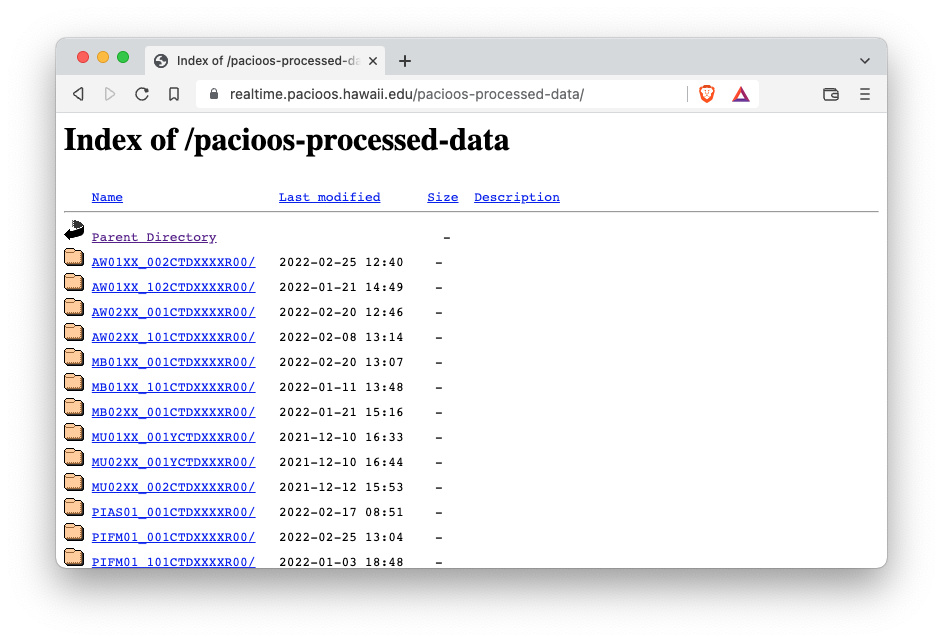

## Viewing Instrument Data and Archives

### Realtime Data

Realtime data that are streaming from nearshore sensors can be immediately viewed by connecting to the Data Turbine web interface at https://realtime.pacioos.hawaii.edu/RBNB.  

Each listed instrument currently has two channels: the raw `DecimalASCIISampleData` channel, and the `PacIOOS2020Format` channel.  

For [example](https://realtime.pacioos.hawaii.edu/RBNB/AW02XX_001CTDXXXXR00):

Each channel of data shows the most current sample streamed to the server, for [example](https://realtime.pacioos.hawaii.edu/RBNB/AW02XX_001CTDXXXXR00/DecimalASCIISampleData):

To view multiple samples at once, add a `duration` parameter with a value of the number of seconds in the past.  For instance, `?d=3600` shows the samples streamed from the [latest hour](https://realtime.pacioos.hawaii.edu/RBNB/AW02XX_001CTDXXXXR00/PacIOOS2020Format?d=3600):

### Archive Summary

Data that are archived on an hourly (`/data/raw`) and daily (`/data/processed`) schedule are indexed into a per-directory JSON structure used to produce a summary [calendar](https://realtime.pacioos.hawaii.edu/archive-status).  This calendar helps visualize gaps in the data archive for those maintaining the drivers and archivers, and shows a list of processed and raw data directories on a per-instrument basis:

### Raw and Processed Archive Data

The raw and processed archived data are available in the `/data/raw` and `/data/processed` folders.  These are also available over HTTP via WebDAV at https://realtime.pacioos.hawaii.edu/pacioos-raw-data:

and https://realtime.pacioos.hawaii.edu/pacioos-processed-data:

